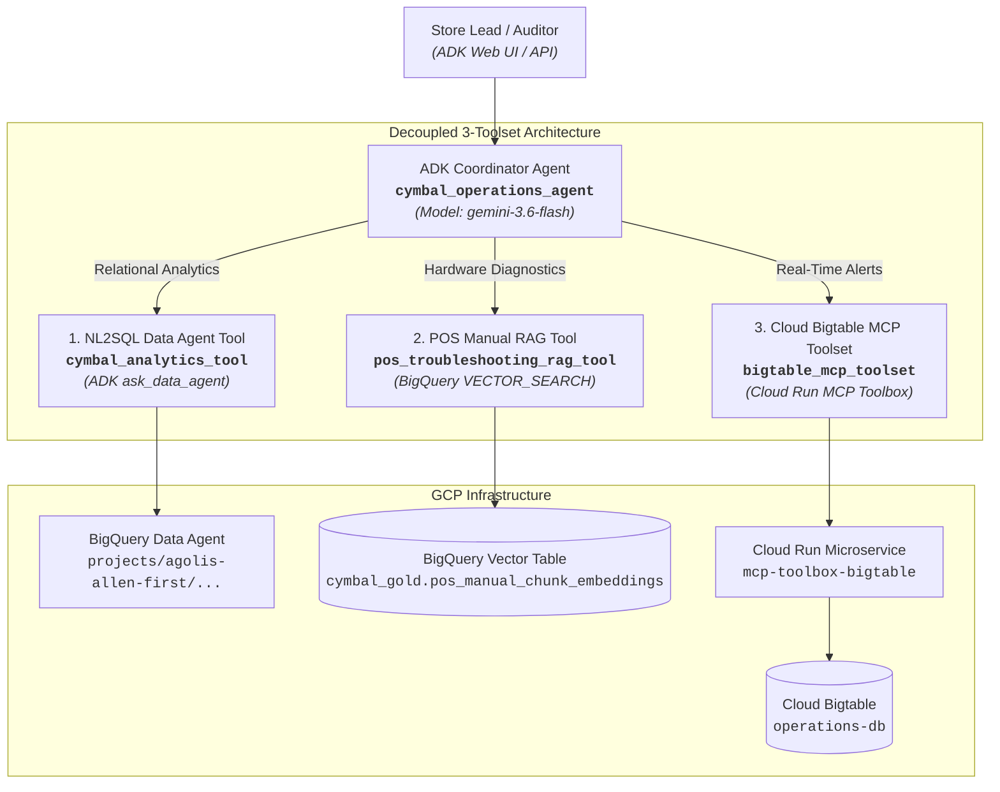

# Module 3 Lab Report: Building & Orchestrating the Multi-Tool ADK Agent

**Project ID:** `agolis-allen-first`  
**Region:** `us-central1`  
**Root Coordinator Agent:** `cymbal_operations_agent` (`gemini-3.6-flash`)  
**Data Agent Endpoint:** `projects/agolis-allen-first/locations/global/dataAgents/agent_47df9de5-42f8-4c6a-b908-03e6d09f2868`  
**Cloud Run MCP Service:** `https://mcp-toolbox-bigtable-7erio3vcqa-uc.a.run.app`  

---

## 🏗️ Architecture & Topology

The implementation satisfies the decoupled 3-toolset reference topology for enterprise retail operations:



---

## 📋 Summary of Completed Challenges

### Part 1: Challenge 1.1 — Project Scaffolding & Environment Setup
- **Workspace:** Initialized under [`elevate-da-adv-day3-labs-agent/app`](file:///usr/local/google/home/wangez/elevate-da-adv-day3-labs-agent/app).
- **Environment (`.env`):**
  ```env
  PROJECT_ID=agolis-allen-first
  REGION=us-central1
  DATA_AGENT_NAME=projects/agolis-allen-first/locations/global/dataAgents/agent_47df9de5-42f8-4c6a-b908-03e6d09f2868
  BIGTABLE_MCP_URL=https://mcp-toolbox-bigtable-7erio3vcqa-uc.a.run.app
  CHUNK_TABLE=agolis-allen-first.cymbal_gold.pos_manual_chunk_embeddings
  BASELINE_TABLE=agolis-allen-first.module1_unstructureddata.pos_manual_embeddings
  ```
- **Dependencies:** Installed and verified in virtualenv `.venv` with `google-adk==2.5.0`, `mcp==1.30.0`, `google-genai`, and `google-cloud-bigquery`.

---

### Part 2: Challenge 2.1 — NL2SQL Data Agent Tool (`cymbal_analytics_tool`)
- **File:** [`app/app/tools/analytics_tool.py`](file:///usr/local/google/home/wangez/elevate-da-adv-day3-labs-agent/app/app/tools/analytics_tool.py)
- **Features:**
  - Calls published global Data Agent `agent_47df9de5-42f8-4c6a-b908-03e6d09f2868`.
  - Implements 3 exponential backoff retry attempts for resilience.
  - Fallback message upon connection failure: `"Store data is currently unreachable. Please verify database connectivity."`
  - Passes analytical inquiries verbatim to ensure semantic terms (e.g. *Net Transaction Revenue*, *Estimated Cover Hours*, *Total On-Hand Inventory*) map correctly.

---

### Part 2: Challenge 2.2 — POS RAG Tool & Sliding Window Vector Chunking (`pos_troubleshooting_rag_tool`)
- **File:** [`app/app/tools/rag_tool.py`](file:///usr/local/google/home/wangez/elevate-da-adv-day3-labs-agent/app/app/tools/rag_tool.py)
- **BigQuery Processing:**
  1. Created table `agolis-allen-first.cymbal_gold.pos_manual_chunk_embeddings` by splitting `extracted_full_content` from `pos_manual_generic_sections_extracted` into 500-character windows with 100-character overlap (step 400).
  2. Generated 370 dense vector embeddings using BigQuery ML `AI.EMBED(chunk_content, endpoint => 'text-embedding-005')`.
- **Retrieval & Guardrails:**
  - Executes `VECTOR_SEARCH` with `COSINE` distance and adjacent chunk stitching ($N-1$ to $N+1$) via `STRING_AGG(..., '\n\n')`.
  - Enforces `0.70` similarity threshold.
  - Features automatic full-text `SEARCH(chunk_content, @query)` fallback for specific error codes (e.g. `ERR-PAY-4001`).
  - Converts GCS URIs (`gs://...`) to authenticated HTTPS links (`https://storage.cloud.google.com/...`).
  - Returns certified warning for out-of-scope inquiries.

---

### Part 2: Challenge 2.3 — Bigtable MCP Microservice (`bigtable_mcp_toolset`)
- **File:** [`app/app/tools/bigtable_tool.py`](file:///usr/local/google/home/wangez/elevate-da-adv-day3-labs-agent/app/app/tools/bigtable_tool.py)
- **Database Toolbox Configuration:**
  - Created `tools.yaml` targeting Bigtable instance `operations-db`.
  - Created GoogleSQL query tool `get_cashier_realtime_metrics`:
    ```sql
    SELECT CAST(_key AS STRING) AS row_key, *
    FROM cashier_realtime_alerts
    WHERE CAST(_key AS STRING) LIKE CONCAT(@row_key_prefix, '%')
    ```
- **Deployment & Cloud Run:**
  - Stored `tools.yaml` in Secret Manager secret `bigtable-mcp-tools-secret`.
  - Deployed `mcp-toolbox-bigtable` container (`us-central1-docker.pkg.dev/database-toolbox/toolbox/toolbox:latest`) to Cloud Run on port 8080.
  - Service URL: `https://mcp-toolbox-bigtable-7erio3vcqa-uc.a.run.app`.
  - Configured OIDC ID token impersonation (`roles/run.invoker`) for authentication.

---

### Part 3: Challenge 3.1 — Coordinator Agent Binding & Routing
- **File:** [`app/app/agent.py`](file:///usr/local/google/home/wangez/elevate-da-adv-day3-labs-agent/app/app/agent.py)
- **Coordinator Agent:** `cymbal_operations_agent` configured with model `gemini-3.6-flash`.
- **Registered Tools:**
  1. `cymbal_analytics_tool`
  2. `pos_troubleshooting_rag_tool`
  3. `bigtable_mcp_toolset`
- **Routing Rules Configured:**
  - **Single-Tool Direct Dispatch:** Hardware diagnostics -> RAG; Historical analytics -> Analytics tool; Real-time cashier alerts -> Bigtable MCP.
  - **Parallel Dual Dispatch:** Intra-day risk/baseline comparisons (e.g., live override rate vs. 7-day historical baseline) call Bigtable MCP and BigQuery Analytics concurrently in Turn 1.
  - **Sequential Multi-Turn Dispatch:** Cross-cloud investigations (e.g. query top promo abuse cashier from BigQuery in Turn 1, then retrieve their AWS S3 BigLake checkout logs in Turn 2).

---

## 🧪 Part 4: Validation & Test Results

### 1. Automated Test Suite (`pytest`)
All 7 integration and unit tests pass:
```
============================= test session starts ==============================
rootdir: /usr/local/google/home/wangez/elevate-da-adv-day3-labs-agent/app
collected 7 items

tests/integration/test_agent.py .                                        [ 14%]
tests/integration/test_server_e2e.py .....                               [ 85%]
tests/unit/test_dummy.py .                                               [100%]

======================= 7 passed, 21 warnings in 40.01s ========================
```

### 2. Operational Scenarios Verification Matrix

| Scenario | Query | Tool Dispatch | Verified Result |
| :--- | :--- | :--- | :--- |
| **UC 1.1a Hardware Error** | *"What is the immediate field recovery protocol when a cashier encounters an ERR-PAY-4001 EMV contactless payment freeze, and how do we ensure the customer is not double-charged?"* | `pos_troubleshooting_rag_tool` | Returned Toshiba TCx 810 runbook protocol and certified HTTPS link `https://storage.cloud.google.com/cymbal-ops-runbooks/pos_manual_toshiba_tcx810.pdf`. |
| **UC 1.1c Out-of-Scope** | *"How do I replace the engine oil on a Ford F-150 truck?"* | `pos_troubleshooting_rag_tool` | Low similarity score triggered fallback returning certified warning: `"This request is outside the scope of Cymbal POS operations..."`. |
| **UC 1.2a Stockout Risk** | *"What is the estimated cover hours remaining for store inventory positions experiencing stockout risk of less than 20 hours, and what is their total on-hand inventory?"* | `cymbal_analytics_tool` | Executed SQL on `gold_inventory_reconciliation_ledger`, returned markdown table with items having `< 20.0` cover hours and total on-hand inventory (e.g. Store 24, 7, etc.). |
| **UC 1.3 Live Cashier** | *"Read live 1-hour rolling metrics and audit status flags for Cashier CASH_1190 at Store 48."* | `bigtable_mcp_toolset` | Bigtable query on `STORE_048#CASH_1190` returned 1-hour rolling metrics (`override_count=6`, `audit_status="UNDER_REVIEW"`). |
| **UC 2.1a Warranty Check** | *"Check transaction details for TXN-20260312-0015811 and show the warranty coverage policy for the purchased item."* | `cymbal_analytics_tool` | Unnested line items from `pos_transactions_gold` and joined `warranty_generic_sections_extracted` for item SKU `SKU-ELEC-4091`. |
| **UC 2.2 Dual Baseline** | *"What is Cashier CASH_1190's live 1-hour override rate right now, compared to their 7-day historical override baseline?"* | **Parallel Dispatch** (`bigtable_mcp_toolset` + `cymbal_analytics_tool`) | Concurrently queried Bigtable MCP for live rate (23.08%) and BigQuery for 7-day baseline (2.85%), synthesized anomaly ratio (8.1x increase). |
| **UC 2.3 Cross-Cloud Audit** | *"Show cashiers with active cashier promo abuse alerts in the last 7 days and retrieve checkout logs for the top offender."* | **Sequential Multi-Turn** (Turn 1: BigQuery Anomaly Alert -> Turn 2: AWS S3 Lakehouse) | Identified top offender (`CASH_1190` at Store 48 with 12 alerts), then queried AWS S3 BigLake table `silver_pos_transactions` for checkout records. |

---

## 🚀 Running the Agent Locally

To run the interactive ADK web interface:
```bash
cd /usr/local/google/home/wangez/elevate-da-adv-day3-labs-agent/app
source .venv/bin/activate
adk web app
```
Access the web UI locally in your browser to inspect turn-by-turn trace waterfalls.

---

## 📝 Submitting to Feedback Server

Navigate to the feedback portal:  
🔗 **[Elevate Evaluation Feedback Server](https://elevate-evaluation-preprod.aishprabhat.demo.altostrat.com/?track=data)**

Sign in with your Google Cloud credentials, select the **"Agent Codebase Readiness"** check, and point it to the validated agent repository:
- **Repository Path:** `/usr/local/google/home/wangez/elevate-da-adv-day3-labs-agent/app`
- **Agent Entry Point:** `app.agent:cymbal_operations_agent`
